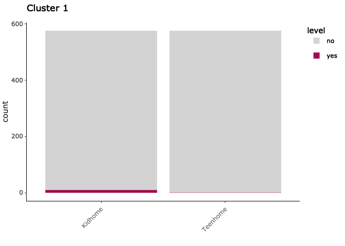
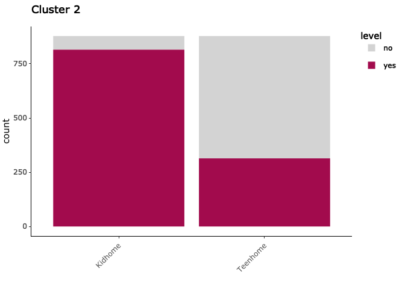
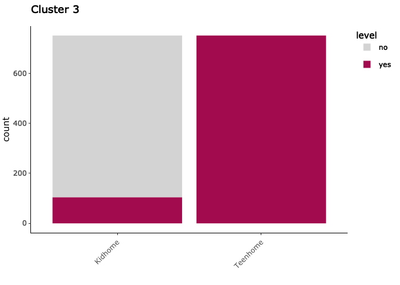
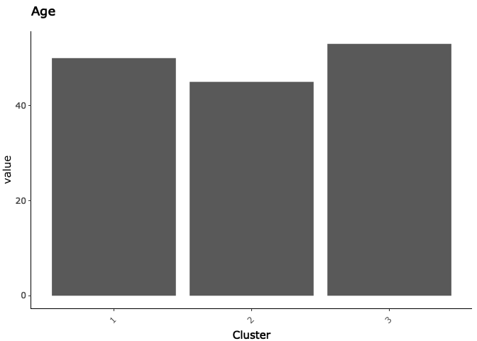
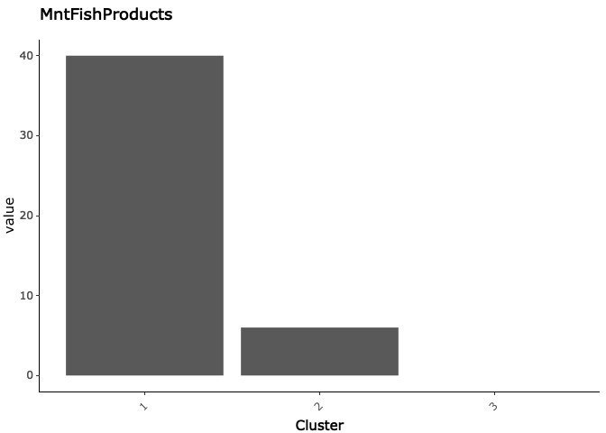
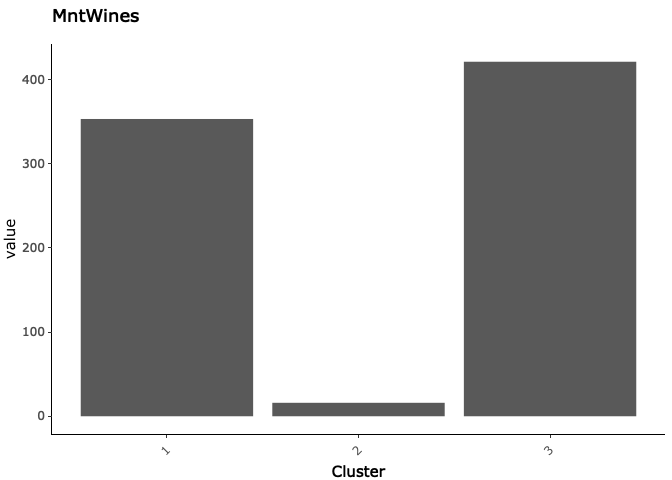
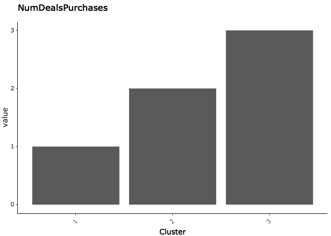

Finding Customer Clusters
================
Veronica Bergstrom
Last updated: 11 March, 2024

- [Load Libraries](#load-libraries)
- [View Data Set](#view-data-set)
  - [Column Names](#column-names)
  - [First Six Observations of the Data
    Set](#first-six-observations-of-the-data-set)
- [Check missing values](#check-missing-values)
- [Create dummy coded variables](#create-dummy-coded-variables)
- [Check columns with zero variance](#check-columns-with-zero-variance)
- [Remove highly correlated
  variables](#remove-highly-correlated-variables)
- [Turn binary variables into
  factors](#turn-binary-variables-into-factors)
- [Select pre-processing options](#select-pre-processing-options)
- [Setup gower object](#setup-gower-object)
- [Figure out optimal number of
  clusters](#figure-out-optimal-number-of-clusters)
- [create pam object](#create-pam-object)
- [visualize clusters](#visualize-clusters)
- [Check Which Cluster Each Observation Was Assigned
  To](#check-which-cluster-each-observation-was-assigned-to)
- [Medoids table](#medoids-table)
- [Visualize Factored Variables by
  Cluster](#visualize-factored-variables-by-cluster)
- [create Visualizations for the Continuous
  Variables](#create-visualizations-for-the-continuous-variables)

At Dacture, I automated code to perform cluster analysis, a type of
unsupervised learning. I have kept the code hidden for privacy reasons.
This script will go through an example of how to use **partition around
medoids (PAM) clustering** to create categories of consumers to target
for marketing purposes. The benefit of PAM clustering over K-means
clustering is that it is better able to handle categorical data.

## Load Libraries

``` r
library(corrplot)
library(gridExtra)
library(GGally)
library(knitr)
library(cluster)
library(ggpubr)
library(factoextra)
library(umx)
library(fastDummies)
library(dplyr)
library(tidyr)
library(naniar)
library(DescTools)
library(caret)
library(ggplot2)
library(plotly)
library(ggforce)
library(NbClust)
library(listviewer)
library(magrittr)
library(jsonlite)
```

## View Data Set

Here is a snippet of the data set that I will be using. There are 2205
observations that represent unique customers. There are 15 variables
that include information such as the amount of wine purchased, age,
number of deal purchases, number of web purchases, etc. Thirteen of the
columns are numeric, whereas two columns are categorical: KidHome
(representing whether kids live in the household) and Teenhome
(representing whether teenagers live in the household).

### Column Names

    ##  [1] "Income"              "Kidhome"             "Teenhome"           
    ##  [4] "Recency"             "MntWines"            "MntFruits"          
    ##  [7] "MntMeatProducts"     "MntFishProducts"     "MntSweetProducts"   
    ## [10] "MntGoldProds"        "NumDealsPurchases"   "NumWebPurchases"    
    ## [13] "NumCatalogPurchases" "NumStorePurchases"   "NumWebVisitsMonth"  
    ## [16] "Z_CostContact"       "Z_Revenue"           "Age"                
    ## [19] "Customer_Days"       "MntTotal"            "MntRegularProds"

### First Six Observations of the Data Set

    ##   Income Kidhome Teenhome Recency MntWines MntFruits MntMeatProducts
    ## 1  58138      no       no      58      635        88             546
    ## 2  46344     yes      yes      38       11         1               6
    ## 3  71613      no       no      26      426        49             127
    ## 4  26646     yes       no      26       11         4              20
    ## 5  58293     yes       no      94      173        43             118
    ## 6  62513      no      yes      16      520        42              98
    ##   MntFishProducts MntSweetProducts MntGoldProds NumDealsPurchases
    ## 1             172               88           88                 3
    ## 2               2                1            6                 2
    ## 3             111               21           42                 1
    ## 4              10                3            5                 2
    ## 5              46               27           15                 5
    ## 6               0               42           14                 2
    ##   NumWebPurchases NumCatalogPurchases NumStorePurchases NumWebVisitsMonth
    ## 1               8                  10                 4                 7
    ## 2               1                   1                 2                 5
    ## 3               8                   2                10                 4
    ## 4               2                   0                 4                 6
    ## 5               5                   3                 6                 5
    ## 6               6                   4                10                 6
    ##   Z_CostContact Z_Revenue Age Customer_Days MntTotal MntRegularProds
    ## 1             3        11  63          2822     1529            1441
    ## 2             3        11  66          2272       21              15
    ## 3             3        11  55          2471      734             692
    ## 4             3        11  36          2298       48              43
    ## 5             3        11  39          2320      407             392
    ## 6             3        11  53          2452      702             688

## Check missing values

You can see that this data set has no missing values. If it did, then I
would impute missing numeric data using knn imputation.

<!-- -->

## Create dummy coded variables

Next, I dummy code (i.e., one hot encode) any categorical variables.
This step is necessary in order to check for multicollinearity among the
variables.

## Check columns with zero variance

Remove zero variance variables because they will not be predictive of
anything.

## Remove highly correlated variables

Removing highly correlated variables for supervised/unsupervised
learning is necessary because highly correlated variables, depending on
the type of model, can hide interactions and provide issues related to
multicollinearity. It also saves on computation time. For this data set,
I ended up removing four columns: MntTotal, MntRegularProds, Income,
MntMeatProducts.

    ## [1] "The following columns were removed: MntTotal, MntRegularProds, Income, and MntMeatProducts"

## Turn binary variables into factors

Factor appropriate variables. Determine variables that have a unique
count of 2, recode 0 or -1 to no and recode 1 to yes. Leave any other
values as they are (e.g., a factored variable of yes-no will be left
alone). Categorical variables will be entered into the algorithm as
factors.

## Select pre-processing options

- to learn about pre-processing arguments:
  <https://machinelearningmastery.com/pre-process-your-dataset-in-r/>
- for imputation, knnImpute and bagImpute are good options. bagImpute is
  more powerful but also more computationally time-consuming knnImpute
  will automatically scale and center the variables as well
- cannot use range if specifying centering, scaling, or box-cox
  transformations

# Setup gower object

Gower’s metric is a distance/dissimilarity measure. It determines which
observations are most and least similar to one another.

# Figure out optimal number of clusters

I have written code to check for the optimal number of clusters between
2 and 20.

    ## [1] "The optimal number of clusters to use is 3"

# create pam object

Next, I create the PAM object using the optimal number of clusters,
which is 3.

# visualize clusters

Shows a 2-dimensional plot of how the clusters visually cluster
together. You can see that this clustering has fairly good seperation.

<!-- -->

# Check Which Cluster Each Observation Was Assigned To

Here, I create a table that shows which cluster each customer was
assigned to (showing the first 6 customers). For example, Customer 1 and
Customer 3 were assigned to Cluster 1.

    ##   row cluster
    ## 1   1       1
    ## 2   2       2
    ## 3   3       1
    ## 4   4       2
    ## 5   5       2
    ## 6   6       3

# Medoids table

The medoids table shows the customer that best represents each cluster.
For example, you can see that Customer 1902 best represents Cluster 1.
In line with results we saw earlier, you can see that this customer does
not have children or teens in their home.

    ##      Recency MntWines MntFruits MntFishProducts MntSweetProducts MntGoldProds
    ## 1902      45      353        61              40               46           27
    ## 237       59       16         3               6                1           13
    ## 813       42      421         5               0               16           10
    ##      NumDealsPurchases NumWebPurchases NumCatalogPurchases NumStorePurchases
    ## 1902                 1               3                   3                 7
    ## 237                  2               2                   0                 3
    ## 813                  3               7                   3                 7
    ##      NumWebVisitsMonth Age Customer_Days Kidhome_yes Teenhome_yes cluster
    ## 1902                 2  50          2530          no           no       1
    ## 237                  8  45          2445         yes           no       2
    ## 813                  5  53          2579          no          yes       3

# Visualize Factored Variables by Cluster

Here, we can see how many customers were grouped under each cluster.
This may be important for determining priorities. For example, if one
customer cluster contains a very small amount of people in it, you may
want to deprioritize marketing efforts toward that cluster (unless they
are spending significantly more on your products than the other clusters
with more members in it).

    ##   cluster   n
    ## 1       1 576
    ## 2       2 878
    ## 3       3 751

Outputs an individual plot for each cluster that shows the frequency of
responses for each variable. For the current data set, we only have 2
categorical variables: KidsHome and TeenHome. Therefore, we can see a
plot for each cluster that shows how many homes have children in their
household and how many homes have teens in their household.

We can see that Cluster 1 has nearly no children or teens in their home;
Cluster 2 almost always has children in their home and has teens in
their home about 35% of the time; Cluster 3 always has teens in their
home and only 12% of these customers have children in their home.

<!-- -->

<!-- -->

<!-- -->

# create Visualizations for the Continuous Variables

Outputs an individual plot for each continuous variable and show the
value of each medoid by each cluster (clusters are on the x-axis). These
values will align with the medoids table.

Here, you can see that there isn’t a huge age difference among any of
the customer clusters.

<!-- -->

However, there is a huge difference between clusters for amount of fish
products purchased, where Cluster 1 purchases much more fish products
than the other clusters.

<!-- -->

You can see that Cluster 1 (which tends to have no children nor teens)
and Cluster 3 (which tends to have only teens) purchases more wine than
Cluster 2 (which tends to have children in the home).

<!-- -->

Lastly, you can see that Cluster 3 (the group that are most likely to
have hungry teens) purchase the most deal products, followed by Cluster
2 (the group most likely to have children) and then Cluster 1 (the group
the least likely to have children or teens).

<!-- -->

I provided figures for four of the numeric variables. In reality, you
would be able to compare the clusters across all thirteen numeric
variables.

To save on marketing resources and reduce email fatigue for customers,
you could strategically offer specific coupons or deals to the cluster
groups that are most likely to purchase them. For example, you could
offer deals on fish products to customers in Cluster 1 rather than
customers in Cluster 2 or 3.
